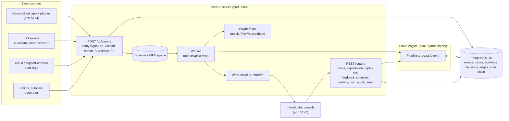
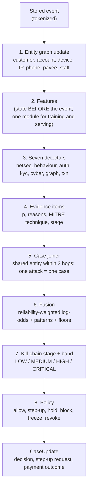
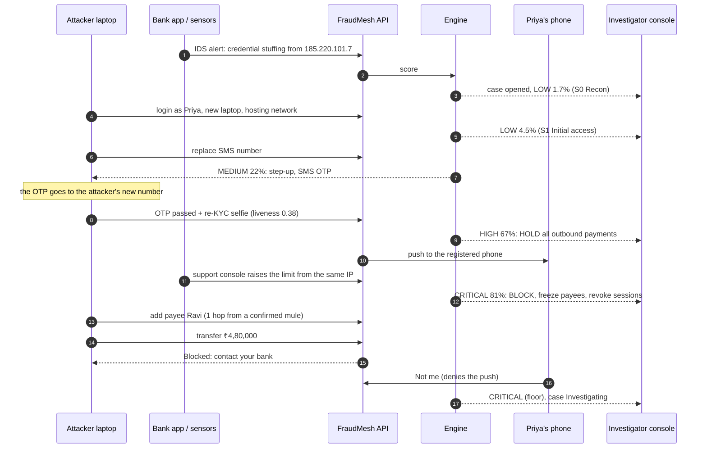
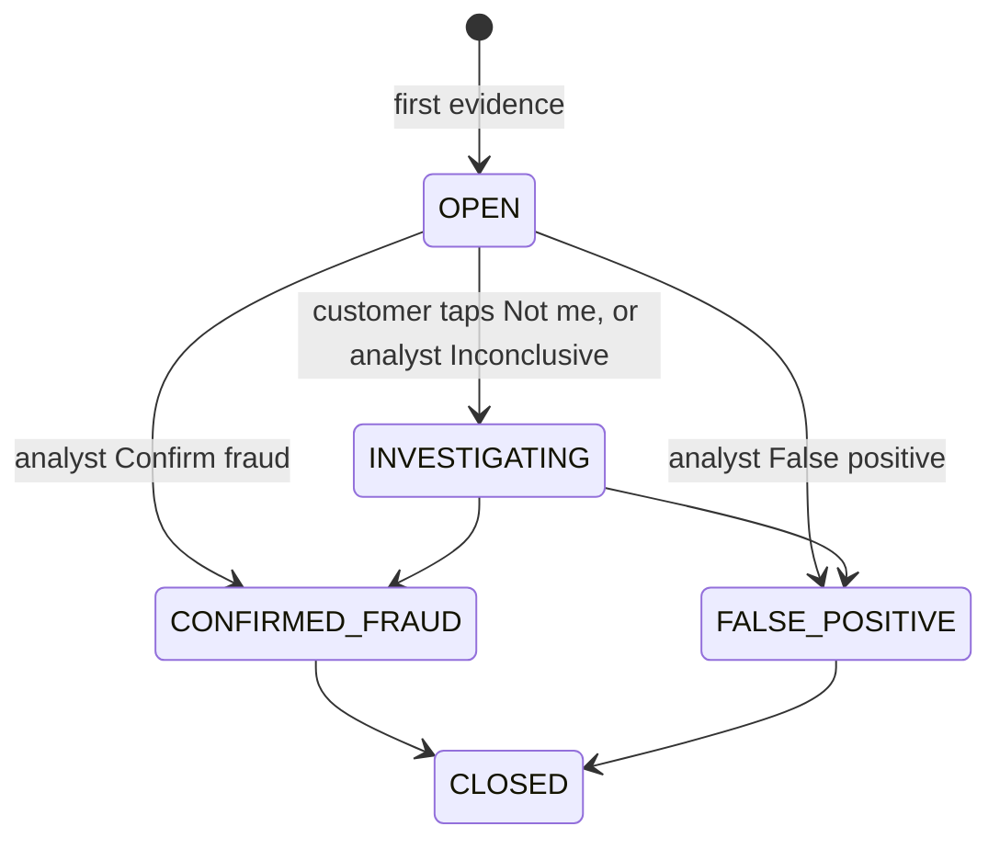
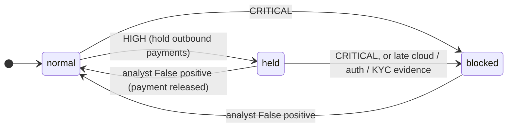
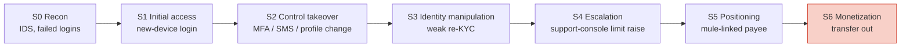
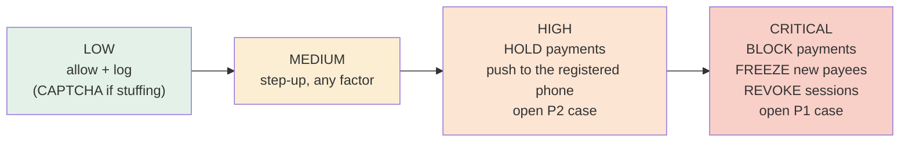
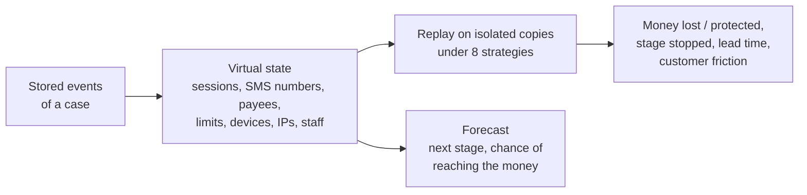
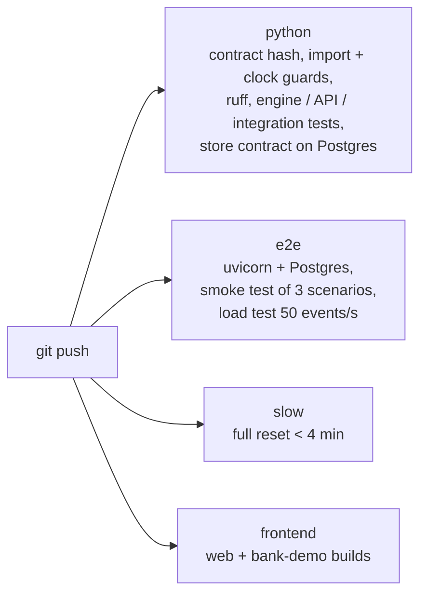

# HR2-OI-9C037B24 — FraudMesh 3.0
HACKERING 2.0 Round 2 Project Repository for Team Global Maxima (Open Innovation Track)

# FraudMesh 3.0

**One attack. Multiple signals. One explainable case.**

FraudMesh turns weak fraud, identity, KYC, device and security signals into **one explainable attack case per attack**,
and acts **before money moves**. A login from a new device, an SMS-number change, a weak KYC selfie, a support-console
limit raise and a new payee each look harmless in their own team's tool. FraudMesh joins them through an entity graph,
fuses them into one probability, holds or blocks payments, explains every decision event by event, replays what would
have happened under other policies, and shows the earliest moment it could have intervened.

> "FraudMesh doesn't replace fraud detectors. It turns scattered signals across fraud, identity, KYC and cyber into one
> attack decision, explains it event by event, and shows the earliest moment it could have stopped it."

The original build spec is [docs/PRD.md](docs/PRD.md) (source of truth: [docs/PRD.pdf](docs/PRD.pdf)); decisions and
deviations made during the build are logged in [docs/CONTRACT_REQUESTS.md](docs/CONTRACT_REQUESTS.md); release notes
are in [CHANGELOG.md](CHANGELOG.md). This README describes the system **as built** (October 2026, v3.0).

### At a glance

| | |
|---|---|
| Account takeovers caught before the money moves (strict benchmark) | **19 / 30** (v2.0: 9 / 30); siloed detectors: 0 / 30 |
| Structuring and mule fan-in caught | **30 / 30** each |
| Genuine customers flagged HIGH | 1 of 1,656 |
| Digital Twin scenario library | **14 of 15** scenarios meet their expected behaviour |
| Decision latency at 50 events/s (CI) | p50 ≈ 5 ms, p95 6–14 ms (target < 150 ms) |
| Tests | ~460 engine, ~280 API, 2 integration; 5 CI jobs |

**Contents**

1. [The problem](#1-the-problem)
2. [What the system can do](#2-what-the-system-can-do)
3. [System architecture](#3-system-architecture)
4. [Workflow: from one event to one decision](#4-workflow-from-one-event-to-one-decision)
5. [How a decision is made](#5-how-a-decision-is-made)
6. [The attack in detail: Midnight account takeover](#6-the-attack-in-detail-midnight-account-takeover)
7. [Mitigation strategies](#7-mitigation-strategies)
8. [Scenario catalogue](#8-scenario-catalogue)
9. [Machine-learning models and measured results](#9-machine-learning-models-and-measured-results)
10. [Digital Twin](#10-digital-twin)
11. [Investigator console and bank demo app](#11-investigator-console-and-bank-demo-app)
12. [Running the demo](#12-running-the-demo)
13. [Security and privacy](#13-security-and-privacy)
14. [API reference](#14-api-reference)
15. [Setup](#15-setup)
16. [Tests and CI](#16-tests-and-ci)
17. [Repository map](#17-repository-map)
18. [Known limitations and honest findings](#18-known-limitations-and-honest-findings)
19. [Future research directions](#19-future-research-directions)
20. [Useful scripts, live Suricata sensor and payment rail](#20-useful-scripts-live-suricata-sensor-and-payment-rail)

---

## 1. The problem

A bank runs separate tools for separate risks. A modern account takeover touches **all** of them, but each tool only
sees its own slice and each slice looks harmless:

| Team / tool | What it sees | Verdict on its own |
|---|---|---|
| Network security (IDS) | Credential stuffing from an IP | Background noise, thousands a day |
| Identity | A successful login from a new laptop | People buy new laptops |
| Authentication | The SMS number was changed | Customers change numbers |
| KYC vendor | A re-verification selfie with weak liveness | Borderline, allow a retry |
| Cloud / support console | A support agent raised a transfer limit | Routine request |
| Payments | ₹4,80,000 to a new payee, OTP passed | Large, but authenticated |

Each signal is weak, so each tool lets it through, and the money leaves. All six were produced by the **same
attacker**, from the **same IP and device**, on the **same customer**, inside 26 minutes. FraudMesh connects them.

## 2. What the system can do

| Capability | What it does | Where |
|---|---|---|
| Signed, private ingestion | 11 event types arrive HMAC-signed per source; every phone, email, IP, device and account is replaced by an HMAC token before storage. No raw PII is stored. | `api/routers/ingest.py`, `engine/common/tokenize.py` |
| Entity graph | Customers, accounts, devices, IPs, phones, payees, staff identities and their links (logged in from, connected via, sent to, shares device…). Hubs, merchants and carrier IPs are excluded so they never join strangers. | `engine/graph/` |
| 7 detectors | Network IDS, login behaviour (ML), auth/MFA, KYC, cloud audit, entity graph, transactions (ML). Each emits evidence with a probability, reasons and an ATT&CK technique. | `engine/detectors/` |
| Case joining | Evidence that shares an entity (within 2 graph hops, 6 h; 72 h for a customer whose case reached control takeover) joins one case; overlapping cases merge. One attack = one case. | `engine/cases/joiner.py` |
| Fusion | Reliability-weighted log-odds over all evidence, sequence-pattern bonuses and hard floors give one P(attack) and a band (LOW / MEDIUM / HIGH / CRITICAL). | `engine/fusion/` |
| Kill-chain stages | S0 Recon → S1 Initial access → S2 Control takeover → S3 Identity manipulation → S4 Escalation → S5 Positioning → S6 Monetization. | `engine/cases/stages.py` |
| Policy and actions | MEDIUM: step-up check. HIGH: hold outbound payments + push to the registered device. CRITICAL: block payments, freeze new payees, revoke sessions. | `engine/policy/policy.yaml`, `api/worker.py` |
| Step-up verification | SMS OTP or push to the registered phone; the customer can tap **"Not me"** (forces CRITICAL). | `api/stepup.py`, bank-demo phones |
| Explanation | Exact log-odds waterfall (every bar is that evidence's contribution) and a template narrative where every sentence cites evidence IDs. | `engine/explain/` |
| Replay | Earliest intervention point, detector ablation ("without KYC"), siloed vs fused comparison. | `engine/replay/` |
| Policy simulator | Move the band thresholds and re-score every stored case. | `engine/replay/simulate.py` |
| Learning from analysts | "Confirm fraud" / "False positive" update each detector's reliability (Beta α/β) and mark fraud seeds in the graph. | `engine/feedback.py` |
| Investigator AI | Answers "Why did you block this?", "What if we ignored KYC?", "Earliest intervention point?" from fixed tools and templates; every sentence must cite real IDs; prompt-injection safe. | `api/investigator/` |
| **Digital Twin** | Replays a case into a virtual copy of the bank and compares 8 prevention strategies on isolated copies, with a stage-by-stage forecast. | `engine/twin/` |
| Benchmark | 14 days × 2,000 customers with 90 held-out attacks; fused vs siloed detection, false positives, alert compression, lead time. | `benchmark/` |
| Live console | Investigator console updates over WebSocket; nothing needs a reload. | `web/` |
| Live two-laptop demo | Priya on one laptop, the attacker on another (same Wi-Fi); a demo IDS sensor, a Demo panel showing only the live case, and an 18-second reset. | `api/demo_baseline.py`, `web/src/screens/DemoPanel.tsx` |
| Audit | Hash-chained, append-only audit log of every decision and analyst action, verifiable on demand. | `api/audit.py` |

**Added in v3.0** (contract 1.1.0, all additive; details in [CHANGELOG.md](CHANGELOG.md)):

| Capability | What it does | Where |
|---|---|---|
| ATO and structuring floors | A new payee within 24 h of a control takeover → at least HIGH at the payee step; a calibrated txn p ≥ 0.90 → HIGH; event-time customer+payee windows for split transfers. | `engine/fusion/v3_core.py`, `engine/features/txn_windows.py`, `rules/v3_core.yaml` |
| Network intelligence | The raw IP is classified (residential / mobile / hosting / vpn / tor / unknown) at ingestion from local files, then tokenized. Geo-confidence weighting; a VPN alone never blocks. | `api/enrichment.py`, `engine/netintel/` |
| Shared IPs and stuffing | Time-windowed shared-IP classifier (carrier IPs never join strangers); account-, device- and global login-failure windows catch distributed credential stuffing. | `engine/graph/shared_ip.py`, `engine/features/identity_windows.py` |
| Device and session | Device-consistency checks and SESSION_CONTEXT_CHANGE on the optional client fields, including hijacked sessions that skip the login. | `engine/detectors/auth.py`, `rules/session_device.yaml` |
| APP scams | Separate path for customer-authorised scam payments; SCAM_WARNING and COOLING_OFF_HOLD; a passed step-up does not release the hold. | `engine/features/app_scam.py`, `rules/app_scam.yaml` |
| Mule rings without seeds | Fan-in, pass-through, fan-out, dormant activation, rapid hops and rings; safe joining through payees. | `engine/graph/mule.py`, `rules/mule.yaml` |
| Insider abuse | Staff changes after a new-device login fire even from the trusted network; two-person approval for limit increases. | `rules/insider.yaml`, `api/routers/limits.py` |
| Feedback guards and late evidence | Reliability bounds and caps against poisoning; late cloud / auth / KYC evidence blocks a held payment before settlement. | `engine/feedback.py`, `engine/policy/policy.yaml` |
| Application security | Server-side sessions + CSRF, SQLi/XSS audit and scanners, AES-256-GCM for selected fields, opt-in TLS / mTLS / Ed25519. | `docs/SECURITY.md` |
| Twin scenario library | 15 attack and benign scenarios played through the real engine, each checked against its expected behaviour. | `benchmark/twin_scenarios.py`, `docs/V3_SCENARIOS.md` |

## 3. System architecture

One FastAPI service, one PostgreSQL database and two static web apps, all in Docker Compose. The fraud engine is a
pure-Python library that the API's single worker calls once per event. No Kafka, no Redis, no graph database: the
queue is in-process and the graph lives in memory, rebuilt from the `edges` table at startup. The whole demo runs offline.

### 3.1 Components



### 3.2 Inside the engine



### 3.3 Deployment

| Container | Port | What |
|---|---|---|
| `db` | 5432 | PostgreSQL 16 |
| `api` | 8000 | FastAPI + worker + engine (`uvicorn api.main:app`) |
| `web` | 5173 | Investigator console (React 18 + Vite + Tailwind, Stitch "Warm Neumorphic Glass" design) |
| `bank` | 5174 | NammaBank demo bank app + simulated phones (Priya's and the attacker's) |

**Seams (frozen):** `engine/contracts.py` (data models, hash-checked in CI), the `Store` protocol and the
`Pipeline` / `engine.api` functions. `engine/` never imports `api/` and never reads the wall clock ("now" is the
event's `occurred_at`), which keeps replays deterministic.

**Stack:** Python 3.11/3.12, FastAPI, Pydantic v2, SQLAlchemy 2, psycopg 3, Alembic, PostgreSQL 16, NetworkX, NumPy,
LightGBM, scikit-learn, SHAP, PyJWT, Argon2; React 18, TypeScript, Vite, Tailwind, TanStack Query, Recharts, Cytoscape.js,
FingerprintJS; Docker Compose; GitHub Actions.

## 4. Workflow: from one event to one decision

### 4.1 Event lifecycle

| # | Step | Where | What happens |
|---|---|---|---|
| 1 | Send | bank app, sensors, scripts | Event signed per source (HMAC-SHA256; optional Ed25519 / mTLS) |
| 2 | Verify | `api/routers/ingest.py` | Bad signature → 401, replayed event → 409, too large → 413, backlog full → 503 |
| 3 | Validate | `engine/contracts.py` | One of 11 event types, strict schema |
| 4 | Enrich | `api/enrichment.py` | The raw IP is classified (residential / mobile / hosting / vpn / tor) from local files |
| 5 | Tokenize | `engine/common/tokenize.py` | Phone, email, IP, device, account, session → HMAC tokens; the raw values are never stored |
| 6 | Store + queue | `api/store_pg.py`, `api/worker.py` | INSERT into `events`, then the FIFO queue (per-customer order kept) |
| 7 | Score | `engine/pipeline.py` | Graph → features → detectors → joiner → fusion → stage → policy (section 3.2) |
| 8 | Act | `api/worker.py`, `api/stepup.py` | Step-up (SMS OTP or push), payment outcome (completed / held / blocked), payment rail |
| 9 | Broadcast | `api/routers/stream.py` | `case_update` to every open console (no reload) |
| 10 | Audit | `api/audit.py` | Hash-chained, append-only log row |
| 11 | Investigate | console | Timeline, graph, explanation, replay, twin, Investigator AI |
| 12 | Learn | `engine/feedback.py` | Analyst verdict → detector reliability (Beta α/β) and fraud seeds |

### 4.2 Live sequence: the Midnight takeover through the system



### 4.3 Case and payment states





On the payment rail a hold is an **authorisation without capture**; a block **voids** it before settlement. A payment
that has settled is never claimed to be reversible.

## 5. How a decision is made

### Kill chain



FraudMesh's goal is to intervene at S2–S5, before S6.

### Events (11 types, `engine/contracts.py`)
`login`, `mfa_change`, `mfa_challenge`, `sim_signal`, `kyc_result`, `profile_change`, `payee_added`, `transaction`,
`cloud_audit`, `network_ids_alert`, `step_up_result`. Sources: `demo-bank-web`, `network-ids`, `cloud-audit`, `simulator`.

### Detectors
| Detector | Looks at | Example reasons | Stage |
|---|---|---|---|
| `netsec` | IDS alerts, failed logins | IDS_SEV2, CREDENTIAL_STUFFING_IP (T1110.004) | S0 |
| `behaviour` | Successful logins (logistic regression + isotonic) | NEW_DEVICE, NEW_ASN, FAR_FROM_HOME, ODD_HOUR, IMPOSSIBLE_TRAVEL | S1 |
| `auth` | MFA / profile / SIM changes, step-up results | MFA_CHANGED_AFTER_NEW_DEVICE, MFA_FAIL_THEN_PASS, PUSH_SPAM, RECENT_SIM_SWAP, CUSTOMER_DENIED | S2 |
| `kyc` | Re-KYC results | LOW_LIVENESS, LOW_FACE_MATCH, DOC_TAMPER, INJECTION_SUSPECTED | S3 |
| `cyber` | Cloud / support-console audit (Sigma-style rules) | cloud_limit_raise_untrusted_ip (T1098), mfa_reset_by_support_untrusted_ip | S4 / S2 |
| `graph` | Payees: distance to confirmed mules, mule flow, name mismatch | SEED_DISTANCE_1/2/3, MULE_FLOW, PAYEE_NAME_MISMATCH | S5 |
| `txn` | Transfers (LightGBM + isotonic, SHAP top reasons) | AMOUNT_HIGH_VS_MEDIAN, NEW_PAYEE, PAYEE_FAN_IN, STRUCTURING | S6 |

Features come from **one** module shared by training and live scoring (`engine/features/features.py`), so there is no
train/serve skew. They are computed from the state *before* each event (amount vs 30-day median, payee fan-in, minutes
since a new device, km from home, travel speed, failed logins per hour…).

### Fusion (`engine/fusion/fusion.py`)
```
ℓᵢ = rᵢ · clip( logit(pᵢ) − logit(π), −2, +3 )        π = base rate 0.01, rᵢ = detector reliability α/(α+β)
L  = logit(π) + Σ δᵢ·ℓᵢ + Σ pattern bonuses            δ = 1 for the strongest item of a family, 0.5 for the rest
P  = 1 / (1 + e^(−L))
```
- **Patterns** (`patterns.yaml`): `pat_ATO1` new-device login → MFA/profile change within 30 min (+0.5);
  `pat_CASE_IP_CLOUD` cloud action from an IP already in the case (+0.3).
- **Floors** (can only raise the band): customer said "Not me" → CRITICAL; payee is a confirmed fraud seed → HIGH;
  3 stages within 30 min → MEDIUM.

### Bands and policy (`engine/policy/policy.yaml`, thresholds 0.20 / 0.50 / 0.80)
| Band | Actions |
|---|---|
| LOW | allow (CAPTCHA for credential stuffing) |
| MEDIUM | step-up, any factor |
| HIGH | hold outbound payments, step-up on the trusted (registered) device, open P2 case |
| CRITICAL | block pending payments, freeze new payees, revoke sessions, open P1 case |

A transfer's outcome is decided with the case state **after** the decision on that same transfer, so a transfer that
pushes its case to HIGH is itself held.

### Fusion, step by step

```mermaid
flowchart LR
    EV["Each evidence item<br/>p from its detector"] --> LO["logit(p) − logit(base rate)"]
    LO --> CL["clip to [−2, +3]<br/>(no single signal decides)"]
    CL --> RW["× detector reliability<br/>α / (α + β)"]
    RW --> FA["× 1 strongest per family<br/>× 0.5 the rest"]
    FA --> SUM["Σ + pattern bonuses"]
    SUM --> P["P(attack) = sigmoid(L)"]
    P --> FL["floors can only raise the band"]
    FL --> BAND["band → policy"]
```



## 6. The attack in detail: Midnight account takeover

Scenario file: `scenarios/midnight_ato.yaml` (PRD §12.2). The victim is **Priya** (customer C-1042, account A-88213),
who banks from her phone in Bengaluru on Airtel.

| Who | Device | Network |
|---|---|---|
| Priya | her phone (`fp_priya_phone`) | 49.207.10.21, Airtel, Bengaluru |
| Attacker | a laptop never seen before (`fp_attacker_01`) | 185.220.101.7, a hosting provider |
| Ravi (payee) | shares a device with a **confirmed mule** account (`A-MULE-01`) | 103.21.4.9, Jio |

| Step | Event | Risk (reference run) | Response |
|---|---|---|---|
| 1 | IDS: credential stuffing from 185.220.101.7 | LOW 1.7% | none |
| 2 | Attacker logs in as Priya from a new laptop on a hosting network | LOW 4.5% | log |
| 3 | SMS number replaced by the attacker's | MEDIUM 22% (`pat_ATO1`) | step-up |
| 4 | OTP passes, because it went to the attacker's swapped number | MEDIUM 40% | counted as a clue |
| 5 | Re-KYC with weak liveness (0.38) | **HIGH 67%** | **hold payments**, push to Priya: earliest intervention, 13 min before the money moves |
| 6 | Support console raises the limit from the same IP | CRITICAL 81% (`pat_CASE_IP_CLOUD`) | block, freeze, revoke |
| 7 | Payee Ravi added: one hop from a confirmed mule device | CRITICAL 97% | |
| 8 | ₹4,80,000 transfer | CRITICAL 99.7% | **blocked** |
| 9 | Priya taps "Not me" | CRITICAL (floor) | case → Investigating |

Every other scenario (mule fan-in, benign travel, structuring, APP scam, mule rings, insider, VPN, proxies, session
replay and more) is in the [scenario catalogue](#8-scenario-catalogue).

### Why every silo alone fails

- The **IDS** sees thousands of stuffing attempts a day; it cannot act on each IP.
- The **login model** sees a new device: genuine customers change devices all the time.
- The **SMS OTP passed**: after the number swap the OTP goes to the attacker. That is why the attacker swapped it first.
- The **KYC** score is borderline; vendors allow a retry.
- The **support-console** action looks routine.
- The **payment engine** sees a large payment with a passed OTP.

FraudMesh sees the **same IP and the same new device** linking all of them, on one customer, inside 26 minutes, and
holds payments at minute 13, **13 minutes before the money moves**.

### The live two-laptop version

1. The attacker logs in from his laptop. The device is not Priya's, so the **demo IDS sensor** raises a
   credential-stuffing alert from his IP (as Suricata would): the case starts at S0.
2. He changes the SMS number → `MFA_CHANGED_AFTER_NEW_DEVICE` → step-up.
3. He adds payee `A-RAVI-778` → `SEED_DISTANCE_1` (one hop from a known mule).
4. He transfers ₹4,80,000 → the app shows **"Blocked – contact your bank"**.
5. Priya's phone gets the push; she taps **"Not me"**.

Measured on the live build: IDS → behaviour → auth → graph → txn, **CRITICAL 98.2%, transfer blocked**.

## 7. Mitigation strategies

FraudMesh escalates its response as evidence builds, so genuine customers are rarely disturbed.



| Strategy | When | How it works | Why it works |
|---|---|---|---|
| Allow + log | LOW | Nothing visible; evidence kept in the case | Single weak signals are usually innocent |
| CAPTCHA | LOW + credential stuffing | Bot challenge on login | Slows automated tools, not people |
| Step-up (any factor) | MEDIUM | SMS OTP or push | Cheap check at moderate risk |
| **Hold outbound payments** | HIGH | Authorised, not captured: the money stays in the bank | Buys time; a genuine payment is released later |
| **Trusted step-up** | HIGH | Push only to the phone registered for months, never to a newly changed number | The attacker cannot answer it; the customer can |
| **"Not me"** | any | Customer denies the push → floor forces CRITICAL | The victim becomes a sensor |
| **Block pending payments** | CRITICAL | Held and new transfers are voided before settlement | The money cannot leave |
| **Freeze new payees** | CRITICAL | No new beneficiary can be added or paid | Stops mule positioning |
| **Revoke sessions** | CRITICAL | Every session for the account is killed | Kicks the attacker out |
| **Late-evidence block** | held case | A late cloud / auth / KYC signal turns the hold into a block | Delayed logs still count |
| **Scam warning + cooling-off** | APP scam signature | Warning and a hold that the customer's own approval does not release | A push proves identity, not intent |
| **Two-person approval** | limit increase on a MEDIUM+ case | A second staff member must approve; self-approval → 403, audited | Stops a single insider |
| **Fraud seeds** | analyst confirms fraud | Attacker device, IP and mule accounts become seeds; payees 1–3 hops away get evidence | The next attack is caught earlier |
| **Earliest intervention + replay** | any case | Shows when FraudMesh could first have acted, and the effect of removing each detector | Proves each silo's value; tunes policy |
| **Policy simulator** | Metrics page | Move the thresholds and re-score every stored case | Trade detection against friction before going live |

**Why OTP is not enough.** A step-up is only as strong as its factor. After the attacker swaps the SMS number, a passed
SMS OTP is a **clue** (a factor changed minutes ago), not proof. At HIGH FraudMesh only accepts a **trusted** factor.

## 8. Scenario catalogue

Every scenario is a YAML file in `scenarios/` (identities, optional preload history, fraud seeds, timed steps and
labels). They run three ways: through the API (console **Demo Simulator** or `scripts/play.py`), directly through the
engine in tests, and in the Digital Twin library (`python -m benchmark.twin_scenarios`, which also generates
scenarios 3 and 5). Results below are from `benchmark/twin_scenarios.json` (synthetic data, real engine;
[docs/V3_SCENARIOS.md](docs/V3_SCENARIOS.md) has the per-scenario detail).

### 8.1 Twin scenario library (15 scenarios, 14 meet their expected behaviour)

| # | Scenario | Attack | What happens | FraudMesh response (measured) | Money stopped |
|---|---|---|---|---|---|
| 1 | `midnight_ato` | Account takeover | Credential stuffing → new-device login → SMS swap → weak KYC → support limit raise → mule payee → transfer | HIGH at minute 13 (hold), CRITICAL, **transfer blocked** | ₹4,80,000 / ₹4,80,000 |
| 2 | `structuring_split` | Structuring | Three transfers just under ₹1,00,000 to one new payee in 5 h | Held from the first transfer (txn high-confidence floor); all three held | ₹2,98,750 / ₹2,98,750 |
| 3 | `shared_ip_30` (generated) | Control | 30 genuine users behind one carrier IP for 6 days | Nothing above LOW, no cross-user case, nobody blocked | — (₹15,435 paid normally) |
| 4 | `device_multi_account` | Same device, many accounts | One cloud bot fails on 4 accounts, gets into Priya's, pays ₹2,40,000 | DEVICE_MULTI_ACCOUNT_FAILURES; **transfer held** | ₹2,40,000 / ₹2,40,000 |
| 5 | `distributed_stuffing` (generated) | Distributed credential stuffing | 8 failures from 8 rotating cloud IPs, then a takeover payment | ACCOUNT_DISTRIBUTED_FAILURES; **transfer held** | ₹2,20,000 / ₹2,20,000 |
| 6 | `benign_vpn` | Control | Priya on a commercial VPN abroad pays a known payee | Location down-weighted for VPN; LOW, payment completes | — (₹30,000 paid normally) |
| 7 | `residential_proxy_ato` | ATO via residential proxy | Home-ISP exit in Priya's city, new device, email change, payee, transfer | PROFILE_CHANGE_AFTER_NEW_DEVICE; **transfer held** | ₹3,80,000 / ₹3,80,000 |
| 8 | `session_replay_clone` | Stolen session, cloned device | Session cookie and fingerprint replayed from a cloud host; payee + transfer, no login | Only weak APP reasons; **not stopped (open gap)** | ₹0 / ₹4,50,000 |
| 9 | `scam_app` | Authorised push payment scam | Priya, on her own phone, is coached to pay an "RBI safe account" | Cooling-off + scam warning; both transfers **held**, her own push approval does not release them | ₹9,80,000 / ₹9,80,000 |
| 10 | `remote_access_demo` | Remote access of the customer's device | Screen-sharing "refund desk" drives Priya's phone: pasted payee, rushed payment | APP cooling-off; **transfer held**; not mislabelled as takeover | ₹2,50,000 / ₹2,50,000 |
| 11 | `mule_ring_noseed` | New mule ring, no known seeds | Young mule accounts take money from victims and pass it on in minutes | MULE_* evidence from the money-flow shape; CRITICAL; onward transfers held / blocked | ₹3,42,000 / ₹4,98,000 |
| 12 | `popular_merchant_legit` | Control | A popular grocer paid by many regular customers | No mule signal, no cross-customer case, nothing above LOW | — (₹14,270 paid normally) |
| 13 | `insider_trusted_network` | Insider abuse | Support identity on the bank's own VPN raises a limit after a suspicious login | INSIDER_* rules fire despite the trusted IP; payments **held** | — (no transfer) |
| 14 | `late_evidence_feedback` | Delayed events + feedback poisoning | Transfer first; cloud-audit and KYC evidence arrive late; then 12 wrong "false positive" verdicts | Held at the transfer, **blocked** by late evidence; reliability stays inside its bounds | ₹3,00,000 / ₹3,00,000 |
| 15 | `appsec_payloads` | SQL injection / XSS strings | Script tags and SQL in the user agent, payee nickname and audit action | Stored and shown as plain data; no case, no hold | — |

### 8.2 PRD scenarios used by the smoke test and the demo

| Scenario | What happens | Expected (verified by) |
|---|---|---|
| `midnight_ato` | The takeover above | One case, CRITICAL, hold before the transfer, transfer blocked (`scripts/smoke_test.py`, `tests/engine/test_midnight_direct.py`, `tests/integration/`) |
| `mule_fanin` | 12 senders pay one mule account within 2 h; the mule sends 90% onward | One case for the mule flow (`tests/engine/test_v3_graph_mule.py`) |
| `benign_odd` | Priya travels to Mumbai with a new phone, approves the push on her registered phone, pays a known payee | Never above MEDIUM (`scripts/smoke_test.py`, `tests/engine/test_scam_direct.py`) |

### 8.3 Benchmark attack families

The seed-7 benchmark (`python -m benchmark.run`) adds 30 attacks per family (account takeover, mule fan-in,
structuring) to 14 days of 2,000 generated customers. Results in section 9.

## 9. Machine-learning models and measured results

### Transaction model (`ml/artifacts/txn_v1.joblib`, LightGBM + isotonic)
Trained on three datasets, each split **by time** so every test period is later than anything the model saw.
Each dataset weighs the same in training.

| Dataset | Transactions | Fraud | Split | Test PR-AUC | Test ROC-AUC |
|---|---|---|---|---|---|
| Synthetic bank events (`ml.generator`, seed 1, 40 attacks per family) | 30,165 | 561 | days 1-9 / 10-11 / 12-14 | 0.9995 | 1.000 |
| [IEEE-CIS Fraud Detection](https://www.kaggle.com/c/ieee-fraud-detection) (real card-not-present) | 590,540 | 20,663 | 60% / 15% / 25% | 0.097 | 0.759 |
| [IBM AMLSim](https://github.com/IBM/AMLSim) samples (fan-in, cycle, both) | 356,613 | 15,006 | 60% / 15% / 25% | 0.742 | 0.867 |

- The model trained on synthetic data alone scored ROC-AUC **0.50 (random)** on the IEEE-CIS and AMLSim test periods; adding them made it 0.76 and 0.87.
- `ml/datasets/` converts each dataset to FraudMesh events and runs them through the engine's own feature module.
- **Evaluated and rejected:** PaySim (its fraud is defined by draining the sender's balance, which our 11 features do not see; 99.7% of its senders appear once) and the Feedzai Bank Account Fraud suite (account-opening applications: no matching detector).
- Calibration error (ECE) ≤ 0.006 on every test set.
- The manifest (`ml/artifacts/manifest.json`) stores the headline (bank events) metrics plus `per_domain` and `pooled_test`.

### Login behaviour model (`ml/artifacts/behaviour_v1.joblib`)
Logistic regression + isotonic on 5 login features, trained on synthetic data (21,391 logins, 28 attack logins).
No real login dataset has been added yet (see future research).

### Benchmark (`benchmark/report.json`: seed 7, 14 days, 2,000 customers, 90 held-out attacks; rerun on v3.0)
| Family | Caught fused (v3.0) | v2.0 | Caught siloed | Median lead time |
|---|---|---|---|---|
| Account takeover | **19 / 30** | 9 / 30 | 0 / 30 | 8 min |
| Mule fan-in | 30 / 30 | 30 / 30 | 30 / 30 | — |
| Structuring | **30 / 30** | 0 / 30 | 30 / 30 | — |

"Caught" uses the strict PRD definition: severity ≥ HOLD **before** the attack's last event. Counted "at or before
the last event" (`benchmark/report_details.json`), every family is 30/30. Genuine customers flagged HIGH: **1 of
1,656** (one benign transfer scored txn p ≥ 0.90); legitimate payments stopped: **11 of 24,503** (that customer's later
payments while held); alert compression **3.59 : 1**. Per-family precision, recall, F1, early detection, lead time and
money prevented: `benchmark/report_v3.json`. The 11 ATO attacks still caught only on the transfer add a payee without a
name check, so there is no payee-step evidence before the money moves.

When the same 90 attacks are loaded into the live demo (`FM_BG_ATTACKS=30`), **every attack forms exactly one case**:
45 CRITICAL, 41 HIGH, 4 MEDIUM, plus 74 LOW cases from genuine customers (none above LOW).

### Performance
Decision latency (event received → payment outcome) at 50 events/s for 120 s on GitHub's Linux runners (v3):
**p50 4.7 ms, p95 6.0 ms**; the target is p95 < 150 ms. The engine alone (`python -m benchmark.perf_pipeline`, 63,237
events) runs at p50 1.4 ms / p95 3.3 ms / p99 5.4 ms per event, 537 events/s on one core. Options evaluated (sharding,
seed-distance cache, a single LightGBM call) and why none was needed: [docs/V3_PERFORMANCE.md](docs/V3_PERFORMANCE.md).

## 10. Digital Twin



A simulation-first **cyber-financial digital twin** (`engine/twin/`), built from the events FraudMesh already stores
(read-only; no new data sources). Console: the **Digital Twin** page and the **Twin** tab of every case.

1. **Virtual state** (`state.py`): sessions, SMS numbers / SIMs, payees, limits, devices, IPs and staff identities,
   updated event by event; entities get tags such as "attacker device", "OTPs now reach the attacker", "1 hop from a known mule".
2. **Attack and policy simulator** (`simulate.py`): replays a case on an **isolated copy** of the starting state under
   8 strategies: no controls · siloed detectors · SMS OTP at MEDIUM · freeze payees at MEDIUM · hold at HIGH ·
   block at CRITICAL · the live FraudMesh policy · FraudMesh + strong txn block (a candidate rule). It reports money
   lost and protected, when and at which stage the attacker was stopped, lead time before the transfer, and friction
   for genuine customers. Attacker vs customer is decided from labels when present, else from `*_NEW_DEVICE` evidence
   and the graph's first-seen dates.
3. **Forecast** (`predict.py`): stage-to-stage transitions learned from 120 labelled attacks (`python -m ml.train_twin`
   → `ml/artifacts/twin_transitions.json`): likely next stage, chance of reaching the money, typical minutes to get there.

Findings on the 90 held-out attacks: no controls lose ₹5.56 Cr; the live FraudMesh policy protects 65%; siloed txn
blocking protects 99.8%; **FraudMesh + strong txn block protects 99.9%**. On Midnight ATO, SMS OTP alone loses the
full ₹4,80,000 (the attacker swapped the number first), while the live policy locks the attacker out 13 minutes
before the transfer. These are simulated outcomes under documented assumptions (shown in the UI), not guarantees.

**Scenario library (v3.0, `python -m benchmark.twin_scenarios`).** 15 scenarios played through the real engine with the
API's ip enrichment: ATO with a new payee, structuring, 30 genuine users behind one carrier IP, one device attacking many
accounts, distributed credential stuffing, a benign VPN user, residential-proxy ATO, stolen-session replay with a cloned
device, APP scam, remote access of the customer's own phone, a new mule ring without seeds, a popular merchant, insider
abuse from the trusted network, late evidence plus feedback poisoning, and SQLi/XSS strings as data. **14 of 15 meet
their expected behaviour**; the open gap is the perfectly cloned stolen session. Results per scenario (stage, band,
reasons, payments, money, twin case kind): [docs/V3_SCENARIOS.md](docs/V3_SCENARIOS.md). Synthetic data throughout.

## 11. Investigator console and bank demo app

**Console (`web/`, port 5173)**, Stitch "Warm Neumorphic Glass" design, all data from the API, live over WebSocket:

| Screen | What it shows |
|---|---|
| Overview | Active / escalated cases, money prevented, model precision, case velocity, priority cases, risk distribution, detector health |
| Case Queue | KPI tiles, search, band tabs, cases sorted by band then most recent, IST times with dates, a LIVE badge on recently active cases |
| Investigations | Dossier list + the full case workbench: header, stage strip, risk-over-time chart, tabs **Timeline · Graph · Explanation · Replay · Twin · Ask**, analyst verdict bar |
| Detection Engine | The 7 detectors (reliability, α/β), per-dataset model metrics, recently escalated cases |
| Metrics & Analytics | Money prevented, precision, compression, false-positive rate, fused vs siloed by family, live impact by band, policy simulator |
| Digital Twin | Virtual bank size and state, riskiest cases, the selected case replayed under every strategy |
| Demo | The live two-laptop demo: only the live case(s), live events, Reset |
| Demo Simulator (admin) | Autopilot scenarios, execution pipeline, live telemetry, intervention result, detectors fired |
| System Health | API, database, pipeline, model artifact, contract, login, RBAC, audit chain, WebSocket checks |
| Settings | Read-only live configuration: bands, policy rules, patterns, models, security, services |

Users: `analyst@`, `lead@`, `admin@fraudmesh.local`, password = `DEMO_PASSWORD` in `.env`. Lead+ can take manual
actions and verify the audit chain; admin can reset and run scenarios.

**Bank demo app (`bank-demo/`, port 5174)**, a fictional "NammaBank": an identity switcher (Priya's phone / Attacker
laptop / this browser), login, security (SMS number), KYC, payees, transfers (shows "Blocked – contact your bank"), and
two simulated phones: `/phone/priya` (receives the push, "Not me") and `/phone/attacker` (receives OTPs after the swap).
It never holds a signing secret: `/v1/demo/emit` signs server-side.

## 12. Running the demo

### A. Live two-laptop demo (recommended)
1. Bring the stack up and make sure the data is in place (a full reset with `FM_BG_ATTACKS=30` gives the 164
   benchmark cases with Priya clean). A full reset automatically saves the **demo baseline**; the Demo page can also
   save the current data as the baseline.
2. **Laptop 1 (Priya):** `http://<host>:5174/phone/priya`.
3. **Laptop 2 (attacker):** `http://<host>:5174`, identity **Attacker laptop**; OTPs arrive at `/phone/attacker`.
   Log in → change the SMS number → add payee `A-RAVI-778` → transfer ₹4,80,000.
4. **Dashboard:** `http://<host>:5173` → **Demo**. The attacker's login makes the **demo IDS sensor** raise a
   credential-stuffing alert from his IP (as Suricata would), so the case starts at Recon; it climbs to CRITICAL, the
   transfer is blocked, and the case appears in the Case Queue (top of CRITICAL, LIVE badge), Investigations, Metrics
   and the Digital Twin.
5. **Reset** (Demo page, admin) restores the baseline snapshot in ~18 s: only the live case disappears, everywhere at
   once (the API broadcasts `demo_reset` to every open console); the benchmark data is not reloaded.

Measured on this build: IDS → behaviour → auth (`MFA_CHANGED_AFTER_NEW_DEVICE`) → graph (`SEED_DISTANCE_1`) → txn,
**CRITICAL 98.2%**, transfer **blocked**, reset in **18.2 s**, 164 benchmark cases intact.

### B. Autopilot
Console → **Demo Simulator** (admin) → pick a scenario → *Trigger scenario* (speed 8 plays the 27-minute Midnight ATO
in about 3.4 minutes), or `python scripts/play.py midnight_ato --speed 8`.

### C. By hand with scripts
`scripts/send_signal.py ids|cloud` sends the two non-bank-app Midnight ATO signals; the rest is clicked in the bank app.

### Resets
| Reset | Time (laptop) | What it does |
|---|---|---|
| **Reset** (Demo page, `POST /v1/demo/reset-live`) | ~18 s | Restore the demo baseline snapshot (Postgres schema `demo_baseline`) and rebuild the engine's memory. Undoes only what happened after the baseline. |
| **Reset sandbox** (Demo Simulator, `POST /v1/demo/reset`, `scripts/reset_demo.sh`) | ~9 min | Truncate everything, regenerate 14 days × 2,000 customers (~63k events) and score every event through the engine one by one; then save a new baseline. Under 4 min on Linux. |

Users, the code, the trained model and `.env` are never touched by either reset.

## 13. Security and privacy

- HMAC-SHA256 signed ingestion (`X-FM-Source`, `X-FM-Timestamp`, `X-FM-Signature`): tampered body → 401, replay → 409.
- PII tokenization: phone, email, IP, device and account are stored only as HMAC tokens.
- JWT access tokens (15 min) + rotating HttpOnly refresh cookie; Argon2 password hashes; roles analyst / lead / admin;
  every case route is filtered by the caller's queues (anything else is a 404, so IDs cannot be probed).
- Rate limits: ingestion 100/s per source, login 5/min per IP, 20/s per user elsewhere → `429 RATE_LIMITED`.
- Security headers on every response (CSP, HSTS, nosniff, no-referrer, frame deny) and an `X-Request-ID`.
- Hash-chained audit log; the API's database role can only INSERT and SELECT it; `GET /v1/audit/verify` recomputes the chain.
- Investigator AI uses fixed tools and templates; customer-supplied text (e.g. a payee named "Ignore previous
  instructions…") never reaches an instruction path.
- CORS: explicit origins, plus an optional `CORS_ORIGIN_REGEX` limited to private LAN ranges for the Wi-Fi demo.

### Transport security and keys (TLS, mTLS, Ed25519, EdDSA)

Everything below is opt-in. Without it, HMAC ingestion signatures and HS256 tokens work exactly as before; the Docker
setup switches the new modes on (see `docs/CONTRACT_REQUESTS.md`, 2026-10-10).

**Keys first.** `python scripts/make_certs.py` writes, under `data/` (gitignored): a local CA (ECDSA P-256), a server
certificate for `localhost`, `127.0.0.1`, `api`, `web`, `bank`, `db`, `proxy`, one client certificate per sender
(CN = `demo-bank-web`, `cloud-audit`, `network-ids`, `simulator`), one Ed25519 signing keypair per sender
(`data/keys/<source>.key|.pub`) and an Ed25519 JWT keypair (`data/keys/jwt.key|.pub`). It keeps existing files;
`--force` regenerates. **Run it before any `docker compose up`** (including `up -d db`): the compose file mounts these
files, and Docker creates empty directories in place of missing ones.

**Docker = TLS everywhere.** A new `proxy` service (nginx) is the only thing that publishes ports, on the same numbers:
https://localhost:8000 (API, `wss://` for `/v1/stream`), https://localhost:5173 (console), https://localhost:5174 (bank).
api, web and bank are internal only. Your browser does not trust the local CA: import `data/certs/ca.crt` as a trusted
root, or accept the warning once per port.
- Downgrade protection: plain `http://` on a TLS port is redirected to `https://` (nginx 497 → 301); HSTS with `always`;
  TLS 1.2 and 1.3 only, ECDHE + AEAD ciphers; `server_tokens off`, uvicorn `--no-server-header`.
- Slowloris and floods: 10 s header/body/send timeouts, 15 s keep-alive, 8 MB body cap, per-IP connection and request
  limits (429), whole requests buffered at the proxy before uvicorn sees them.
- Mutual TLS: `POST /v1/events` and `/v1/events/batch` need a client certificate signed by the local CA (else 403
  `FORBIDDEN`). The proxy passes `X-Client-Cert-Verify` / `X-Client-Cert-DN` (overwriting anything the client sent), and
  with `FM_REQUIRE_CLIENT_CERT=1` the API also checks that the certificate's CN equals `X-FM-Source`
  (else 401 `SIGNATURE_INVALID`). Only set that flag when the API is reachable through the proxy alone.
- The console and bank app send a strict CSP (self-hosted scripts, fonts and styles only; the API origin for
  `connect-src`). Because of that CSP and the certificate names, the Wi-Fi multi-device setup needs extra work under TLS.
- Postgres runs with `ssl=on` and a `pg_hba.conf` that rejects non-TLS TCP; port 5432 is bound to 127.0.0.1 only; the
  API connects with `sslmode=verify-full`. Host tools negotiate TLS automatically (libpq `sslmode=prefer`).
- The api container runs as a non-root user with `no-new-privileges` and all capabilities dropped. The refresh cookie
  is `Secure` (`FM_TLS=1`). Access tokens are EdDSA (`FM_JWT_ALG=EdDSA`) with an `iss` claim.

**Sending events to the TLS stack from the host:**
```bash
export FM_TLS_CA=data/certs/ca.crt          # trust the local CA; client certs come from data/certs/<source>.crt
export FM_SIGN_ALG=ed25519                  # optional: sign with data/keys/<source>.key instead of HMAC
python scripts/play.py midnight_ato --api https://localhost:8000
python scripts/smoke_test.py --api https://localhost:8000
```
Every sender (`play.py`, `send_event.py`, `send_signal.py`, `smoke_test.py`, `perf.py`, the Suricata adapter) takes its
TLS settings from `scripts/tls.py:httpx_kwargs(source)`, which presents the client certificate matching each event's source.

**Ed25519 ingestion signatures.** Header `X-FM-Signature-Alg: ed25519` (absent = HMAC). Same message as §7.2
(`timestamp + "." + body`), `X-FM-Signature` is the hex signature, verified with `<source>.pub`. The API signs its own
events (`/v1/demo/emit`, step-up results, autopilot) with Ed25519 when it holds that source's private key.

| Variable | Default | Meaning |
|---|---|---|
| `FM_INGEST_AUTH` | `any` | `hmac`, `ed25519` or `any`: signature algorithms `/v1/events` accepts |
| `FM_SIGN_ALG` | `hmac` | Senders: `ed25519` signs with `FM_SIGNING_KEY_DIR/<source>.key` when it exists |
| `FM_SIGNING_KEY_DIR` / `FM_SIGNING_PUBLIC_KEY_DIR` | `data/keys` | Ed25519 private / public keys |
| `FM_JWT_ALG` | `HS256` | `HS256` (`JWT_SECRET`) or `EdDSA`; only the configured algorithm is accepted |
| `FM_JWT_PRIVATE_KEY` / `FM_JWT_PUBLIC_KEY` | `data/keys/jwt.key` / `.pub` | EdDSA token keys |
| `FM_REQUIRE_CLIENT_CERT` | `0` | `1`: ingestion needs the proxy's verified client cert with CN = source |
| `FM_TLS` | `0` | `1`: `Secure` refresh cookie |
| `FM_TLS_CA` / `FM_TLS_CERT_DIR` | unset / `data/certs` | Senders: CA to trust, and where client certs live |

## 14. API reference

| Method + path | Role | Purpose |
|---|---|---|
| `POST /v1/auth/login`, `/refresh`, `/logout` | — | Sessions |
| `POST /v1/events`, `/v1/events/batch` | signed source | Ingest events |
| `GET /v1/cases`, `/v1/cases/{id}` | analyst | Queue and case detail |
| `GET /v1/cases/{id}/timeline`, `/graph`, `/explanation` | analyst | Evidence, decisions, step-ups; Cytoscape graph; waterfall + narrative |
| `POST /v1/cases/{id}/replay`, `/ask`, `/feedback` | analyst | Replay / ablation, Investigator AI, analyst verdict |
| `POST /v1/cases/{id}/actions` | lead | Manual hold / block / freeze / revoke |
| `GET /v1/cases/{id}/twin`, `GET /v1/twin/overview` | analyst | Digital Twin |
| `GET /v1/detectors`, `/v1/metrics/summary`, `POST /v1/simulate` | analyst | Detector reliability, metrics + benchmark, policy simulator |
| `GET /v1/engine/config` | analyst | Read-only bands, policy rules, patterns, model manifest |
| `GET /v1/audit/verify` | lead | Recompute the audit hash chain |
| `GET /v1/health` | — | db, pipeline_ready, contract version, model SHA-256 |
| `WS /v1/stream` | analyst (token in first message) | `case_update`, `challenge_update`, `demo_reset` |
| `/v1/demo/*` (only when `DEMO_MODE=1`) | mixed | `emit` (bank app; includes the demo IDS sensor), `payment-status`, `step-up/pending`, `sms-inbox`, `step-up/{id}/respond`, `run/{scenario}` (admin), `reset` (admin), `baseline` (admin), `live` (analyst), `reset-live` (admin) |

## 15. Setup

### Docker (normal way)
```bash
python scripts/make_env.py            # writes .env with fresh secrets; prints the seed-user password
docker compose -f deploy/docker-compose.yml up -d --build
docker compose -f deploy/docker-compose.yml exec api python scripts/seed_users.py
```
Open http://localhost:5173. Then reset the demo once (console → Demo Simulator → Reset sandbox, or
`docker compose -f deploy/docker-compose.yml exec api scripts/reset_demo.sh`) to load the background data.

### Other devices on the same Wi-Fi
The containers listen on all interfaces. Others open `http://<this laptop's Wi-Fi IP>:5173` and `:5174`. The apps call
the API on the host they were loaded from; the API accepts those origins when `.env` sets `CORS_ORIGIN_REGEX` (private
LAN ranges, ports 5173/5174 only; off by default). Recreate the api container after changing `.env`. If another device
cannot connect, allow inbound TCP 5173, 5174 and 8000 in Windows Firewall; phone hotspots may isolate clients.

### Local development (no Docker for the app)
```powershell
docker compose -f deploy/docker-compose.yml up -d db
py -3.12 -m venv .venv
.venv\Scripts\pip install -r api\requirements.txt -r engine\requirements.txt ruff
.venv\Scripts\python scripts\make_env.py
.venv\Scripts\alembic -c api\db\alembic.ini upgrade head
.venv\Scripts\python scripts\seed_users.py
.venv\Scripts\uvicorn api.main:app --port 8000 --env-file .env --reload
cd web; npm install; npm run dev          # http://localhost:5173
cd bank-demo; npm install; npm run dev    # http://localhost:5174
```
Stop local dev servers before using the Docker web containers: both bind 5173/5174 and `localhost` reaches the dev server first.

### Environment variables (`.env`)
| Variable | Default | Meaning |
|---|---|---|
| `DATABASE_URL`, `HMAC_SECRETS`, `TOKEN_KEY`, `JWT_SECRET`, `DEMO_PASSWORD` | written by `make_env.py` | Connection and secrets |
| `BASE_RATE`, `BAND_MEDIUM`, `BAND_HIGH`, `BAND_CRITICAL` | 0.01 / 0.20 / 0.50 / 0.80 | Fusion base rate and band thresholds |
| `DEMO_MODE` | 1 | Mount `/v1/demo/*` |
| `CORS_ORIGINS` | localhost:5173,5174 | Allowed console / bank origins |
| `CORS_ORIGIN_REGEX` | unset | Extra origins for the Wi-Fi demo (private LAN only) |
| `FM_BG_DAYS`, `FM_BG_CUSTOMERS` | 14, 2000 | Size of the reset's background |
| `FM_BG_ATTACKS` | 0 | Attacks per family loaded into the background (30 = the benchmark's 90) |

### Retraining
```powershell
.venv\Scripts\python -m ml.generator.run --seed 1 --attacks 40 --out data/train.jsonl --labels data/train_labels.jsonl
.venv\Scripts\python -m ml.train_txn --ieee "<dir with train_transaction.csv>" --amlsim "<AMLSim sample/ dir>" --cache data/features
.venv\Scripts\python -m ml.train_behaviour
.venv\Scripts\python -m ml.train_twin
.venv\Scripts\python -m benchmark.run
```
Raw datasets are not in the repository (size and licences); about 15 minutes the first time, 1 minute with the feature cache.

## 16. Tests and CI



```powershell
.venv\Scripts\python scripts\verify_contracts.py     # engine/contracts.py hash == docs/CONTRACT_HASH
.venv\Scripts\ruff check .
.venv\Scripts\python -m pytest tests/engine -q       # ~460 tests: detectors, fusion, joiner, golden values, models, datasets, twin, v3 rules, scenario library
.venv\Scripts\python -m pytest tests/api -q          # ~280 tests: auth, sessions, CSRF, ingest, RBAC/IDOR, SQLi/XSS, crypto, demo, twin, payment rail (needs Postgres)
.venv\Scripts\python -m pytest tests/integration -q  # Midnight ATO end to end through the API
.venv\Scripts\python scripts\smoke_test.py --all     # PRD §14.5 checks against a running API
.venv\Scripts\python scripts\perf.py --rate 50 --seconds 120
.venv\Scripts\python -m benchmark.run               # seed-7 benchmark -> benchmark/report*.json (~3 min)
.venv\Scripts\python -m benchmark.twin_scenarios    # 15-scenario twin library -> benchmark/twin_scenarios.json, docs/V3_SCENARIOS.md
.venv\Scripts\python -m benchmark.perf_pipeline     # engine latency per event -> benchmark/perf_pipeline.json
cd web; npm run build; cd ..\bank-demo; npm run build
```
GitHub Actions (`.github/workflows/ci.yml`) runs five jobs on every push: `python` (contract, guards, ruff, all suites,
store contract on Postgres), `e2e` (uvicorn + Postgres, smoke test of all three scenarios, perf at 50 events/s),
`slow` (full-size reset < 4 min), and `frontend` builds for `web` and `bank-demo`.

## 17. Repository map

| Path | What |
|---|---|
| `engine/` | The fraud engine: `contracts.py` (frozen models), `common/` (settings, ids, tokenize), `graph/`, `features/`, `detectors/` (+ `rules/` calibration and Sigma-style rules), `cases/` (joiner, stages), `fusion/` (+ patterns.yaml), `policy/` (+ policy.yaml), `explain/`, `replay/` (replay + simulator), `feedback.py`, `twin/`, `pipeline.py`, `store_memory.py`, `api.py` |
| `api/` | FastAPI app: `routers/`, `worker.py`, `store_pg.py`, `stepup.py`, `investigator/`, `adapters/suricata.py`, `audit.py`, `security.py`, `middleware.py`, `demo_*` (identities, reset, baseline), `autopilot.py`, `db/` (Alembic) |
| `ml/` | `generator/` (synthetic bank + attacks), `scenario.py`, `datasets/` (IEEE-CIS, AMLSim adapters), `train_txn.py`, `train_behaviour.py`, `train_twin.py`, `artifacts/` |
| `scenarios/` | PRD scenarios (`midnight_ato`, `mule_fanin`, `benign_odd`), `scam_app`, the v3 scenarios (mule ring, popular merchant, insider, and the Phase 15 twin library), IDS sample lines |
| `benchmark/` | `run.py` + `report*.json`, `twin_scenarios.py` + `twin_scenarios.json`, `perf_pipeline.py` + `perf_pipeline.json` |
| `web/`, `bank-demo/` | The two React apps |
| `scripts/` | Env, seeding, signing, play / load / reset, smoke, perf, contract checks |
| `deploy/` | Docker Compose, Dockerfiles, nginx |
| `tests/` | `engine/`, `api/`, `integration/` |
| `docs/` | PRD, contract hash, contract requests and decision log, `SECURITY.md`, `V3_DATA_COLLECTION.md`, `V3_COMPETITIVE_ANALYSIS.md`, `V3_SCENARIOS.md`, `V3_PERFORMANCE.md` |

Original ownership (PRD §3): Dev 1 owned `api/`, `web/`, `bank-demo/`, `scripts/`, `deploy/`, `tests/api|integration`;
Dev 2 owned `engine/`, `ml/`, `scenarios/`, `benchmark/`, `tests/engine`; `engine/contracts.py`, `engine/common/*`,
`CLAUDE.md`, `docs/PRD.md` are frozen for both.

## 18. Known limitations and honest findings

- **Synthetic core.** The cross-silo attack chains (IDS + login + MFA + KYC + cloud + payment for one customer) are
  synthetic: no public dataset links these silos for the same customer. Each detector's realism is limited by its data.
- **Single-signal attacks.** Fusion deliberately won't act on one weak signal. v3.0 adds two floors (new payee after a
  takeover; calibrated txn p ≥ 0.90) that lift structuring to 30/30 and ATO to 19/30 strict; the txn floor is a
  model-confidence rule, not proof of structuring, and costs 1 benign customer of 1,656.
- **Cloned stolen sessions.** A stolen session replayed with a perfectly cloned device from a hosting network is not
  stopped (twin scenario `session_replay_clone`, strict xfail). It needs a session-level network-type escalation rule or
  device-bound sessions (designed in docs/SECURITY.md, not built).
- **Real-data accuracy.** On IEEE-CIS the txn model reaches ROC 0.76 / PR-AUC 0.10 with 11 banking features (Kaggle
  winners used about 400 card/email/device features). The login model is trained on synthetic data only.
- **Dormant-account artefact.** `hour_deviation` is exactly 0 when a customer has no login in 30 days; the IEEE-trained
  model treats that as risk (p ≈ 0.19, stays LOW alone). Documented in a test.
- **Shared-payee chaining.** v3.0 joins cases through a payee only with two payee bridges, or one suspicious bridge with
  corroborating evidence on both sides; mule fan-in is still one case and a popular legitimate merchant links nobody.
- **Not connected:** Firebase (boundary + fake-client tests only), a live payee / mobile-number risk registry (fixture
  provider only), commercial IP-intelligence feeds (local files only). See CHANGELOG.md.
- **Probabilities are calibrated on mixed domains**; the headline metrics use the bank-event test split.
- **Laptop speed.** The full reset takes ~9 min on Windows / Docker Desktop (each event crosses the VM boundary);
  hence the 18-second baseline reset for demos.
- **Demo-only pieces.** The demo IDS sensor, the bank app and the phones stand in for Suricata, a real core banking
  front end, a telco and a push provider.
- **Twin assumptions.** The twin's outcomes depend on stated behaviour assumptions (e.g. the customer denies a push
  within 10 minutes); they are not predictions of real attacker behaviour.

## 19. Future research directions

1. **Real login data for the behaviour model:** the RBA login dataset (Wiegand et al., 33M logins, IP / ASN / device /
   user agent, account-takeover labels, CC BY 4.0, Zenodo 6782156). Expected: honest ROC on real logins.
2. **Richer transaction features:** a balance-drain ratio (would make PaySim usable), device/email/card mismatch,
   merchant-category novelty; measure gain per feature on IEEE-CIS while keeping the bank-event headline.
3. **Domain-aware calibration:** calibrate on the deployment domain only, or per-domain isotonic, so cross-dataset
   training improves ranking without shifting live probabilities.
4. **Policy research with the twin:** search thresholds and rules (e.g. txn ≥ 0.9 block, payee freeze timing) to
   maximise money protected under a friction budget; validate on held-out attacks before changing `policy.yaml`.
5. **Graph learning:** learned mule-risk scores (GNNs, personalized PageRank from seeds, community detection) to replace
   fixed seed distance; payee reputation to stop popular-payee chaining.
6. **Sequence models:** learn stage transitions conditioned on features (Markov → HMM / transformer over event
   sequences) for earlier, better-calibrated forecasts; compare lead time with the rule patterns.
7. **Scams / authorised push payment fraud:** the customer is the actor (no new device); needs behavioural and
   conversational signals; the twin already separates "attacker" from "scammed customer".
8. **Online learning from analyst feedback:** beyond Beta reliability, periodic retraining from confirmed cases with
   drift monitoring.
9. **Live integrations:** a real Suricata sensor, cloud audit streams (CloudTrail / Azure AD), telco SIM-swap APIs,
   PayPal sandbox payments with authorize-then-capture (planned design: hold → authorize only, block → void).
10. **Scale:** Kafka for ingestion, partitioned workers per customer shard, a graph database for very large networks;
    keep per-event p95 under 150 ms.
11. **Fairness and false-decline analysis:** the Bank Account Fraud suite's bias variants for onboarding-risk research.

## 20. Useful scripts, live Suricata sensor and payment rail

### Useful scripts

| Script | Purpose |
|---|---|
| `scripts/make_env.py` | Write `.env` with fresh secrets |
| `scripts/seed_users.py` | Upsert the three demo users |
| `scripts/sign.py` | `sign(source, body) -> headers`: the only code that builds ingestion signatures |
| `scripts/send_event.py` | Manual ingestion check (signed → 202, tampered → 401, repeat → 409) |
| `scripts/send_signal.py` | `ids` / `cloud`: the two non-bank-app Midnight ATO signals |
| `scripts/play.py`, `scripts/load.py`, `scripts/reset_demo.sh` | Play a scenario, bulk-load events, full reset |
| `scripts/smoke_test.py`, `scripts/perf.py` | §14.5 smoke checks, latency test |
| `scripts/seed_demo_factors.py` | SMS + push factors for the named demo customers |
| `scripts/gen_ts_types.py` | Regenerate the TypeScript contract types |
| `scripts/verify_contracts.py` | CI contract-hash check |
| `python -m api.adapters.suricata <eve.jsonl> --post` | Suricata EVE alerts → signed events |

### Live Suricata sensor

`api.adapters.suricata` replays a saved `eve.jsonl`; `api.adapters.suricata_live` follows a real sensor's `eve.json`
as it grows and posts each `alert` line as a signed `network_ids_alert` event (source `network-ids`).

```bash
python -m api.adapters.suricata_live /var/log/suricata/eve.json --api http://127.0.0.1:8000 --batch 100
# options: --from-start  --state data/suricata_live.state  --batch N (1 = /v1/events, >1 = /v1/events/batch, max 500)
#          --poll 0.5  --once (process what is in the file now, then exit)
```

- Follows the file like `tail -F`: waits for it to appear, waits for a half-written last line, and starts again at
  byte 0 when the file is rotated (new inode) or truncated. Non-alert and malformed lines are counted and skipped.
- Starts at the end of the file (new alerts only) unless `--from-start`. The byte offset and file identity are saved
  to the state file after every successful post, so a restart neither resends nor skips alerts. Delivery is
  at-least-once: lines in flight during a crash are sent again after the restart, with new event ids.
- Connection errors, 429 (honouring `Retry-After`) and 503 `ENGINE_UNAVAILABLE` (API backlog full) are retried with
  capped exponential backoff and jitter; a line the API refuses for good (401/422) is logged and skipped.
- Signs with `scripts/sign.py` (HMAC key from `.env`); uses `scripts/tls.py` for TLS / mTLS when it is present.
- Limitation: the follower re-opens the path on every poll, so with rename-style rotation, lines the sensor writes to
  the renamed file after the last poll are not read. Rotate with `copytruncate` (handled as truncation) or keep the
  poll interval short.

### Payment rail (PayPal sandbox / offline mock)

Every `transaction` event's payment outcome (`completed` / `held` / `blocked`, PRD §6.4) is also mirrored onto a
payment processor by `api/payments/`. The rail runs off the event worker's path: the worker queues the outcome after
it releases `engine_lock`, and one background task makes the rail calls in a thread. A rail failure never slows or
breaks event processing; it is logged, written to the row's `last_error`, audited as `PAYMENT_RAIL_ERROR` and retried
with backoff (`FM_PAYMENT_MAX_ATTEMPTS`, default 5).

| FraudMesh | Rail action | Rail state |
|---|---|---|
| outcome `completed` | authorize, then capture | `CAPTURED` |
| outcome `held` | authorize only (the hold) | `AUTHORIZED` |
| outcome `blocked` | authorize, then void | `VOIDED` |
| feedback `FALSE_POSITIVE` on a held payment's case | capture | `CAPTURED` |
| feedback `CONFIRMED_FRAUD` on a held payment's case | void | `VOIDED` |

States: `CREATED → AUTHORIZED → CAPTURED | VOIDED` (table `payment_rail`, migration `0003_payment_rail`). Voids and
released holds are audited (`PAYMENT_VOIDED`, `PAYMENT_CAPTURED`, `PAYMENT_*_SCHEDULED`); the routine capture of a
completed payment is not. `GET /v1/cases/{case_id}/payments` (analyst+, queue-filtered, 404 outside your queues)
lists each transaction of a case with its outcome and rail state. `GET /v1/demo/payment-status/{event_id}` is unchanged.

| Env var | Default | Meaning |
|---|---|---|
| `FM_PAYMENT_RAIL` | `mock` | `mock` (offline, deterministic, in memory), `paypal_sandbox`, or `off` |
| `FM_PAYMENT_CURRENCY` | `INR` (mock), `USD` (sandbox) | Rail currency |
| `PAYPAL_CLIENT_ID`, `PAYPAL_CLIENT_SECRET` | — | Sandbox REST app credentials; without both, `paypal_sandbox` falls back to the mock |
| `PAYPAL_BASE_URL` | `https://api-m.sandbox.paypal.com` | PayPal REST base URL |
| `PAYPAL_VAULT_ID` | — | Optional sandbox vaulted payment-method id, so PayPal can authorize without a buyer approving each order |
| `FM_PAYMENT_MAX_ATTEMPTS` | `5` | Rail attempts per payment before giving up |

**Sandbox flow:** OAuth2 client credentials (token cached until expiry) → `POST /v2/checkout/orders` (`intent:
AUTHORIZE`) → `POST /v2/checkout/orders/{id}/authorize` → `POST /v2/payments/authorizations/{id}/capture` or `/void`.
Each call carries `PayPal-Request-Id` = the event id (`<event_id>-authorize`, `-capture`, `-void` for the later steps),
so retries are idempotent. 429 / 5xx / network errors are retried with exponential backoff; a 401 refreshes the token
once. Without `PAYPAL_VAULT_ID`, PayPal only authorizes an order a buyer has approved, so a server-side authorize
answers `422 ORDER_NOT_APPROVED`, which is recorded on the row.

**Privacy and money:** PayPal receives the event id as `reference_id`, a constant description and the amount. No
account number, payee token, name or customer reference is sent. Amounts convert 1:1 from paise to minor units of the
rail currency (₹ 1,500.00 = 150000 paise → `"1500.00"` USD in the sandbox; no FX, since sandbox money is not real).
Secrets are never logged. The tests (`tests/api/test_payment_rail.py`) run the sandbox adapter against
`httpx.MockTransport` only; no test calls PayPal.

